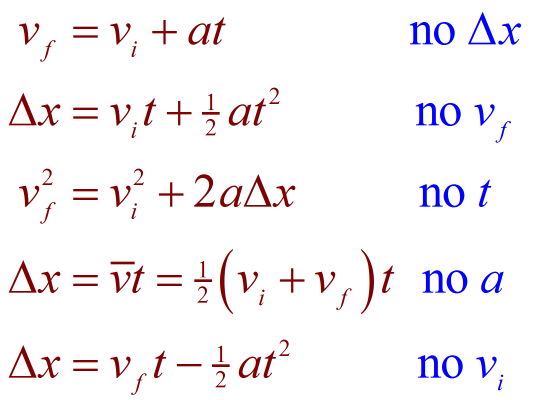

# Kinematic-Equation-Calculator

A way to solve kinematic equations faster.

I am in college physics and the amount of homework I am given involving kinematic equations
is quite large. So I am creating this calculator to better focus my attention on my other college courses.

This calculator involves the use of 5 kinematic equations, in which the variables used are
* Initial Velocity
* Final Velocity
* Displacement
* Acceleration
* Time

Each kinematic equation involves 4 of these variables.

You need at least 3 of these variables to solve for an unknown variable.

## Here are the 5 kinematic equations:

;

The program has 2 java files. One file called "**_controls.java_**", and another called "**_kinematicEquations.java_**"

"**_controls.java_**" consists of a scanner for input, printing to the terminal for output, and a control structure to decide which of the five equations to use.

"**_kinematicEquations.java_**" consists of 5 methods, each one representing a different kinematic equation.

