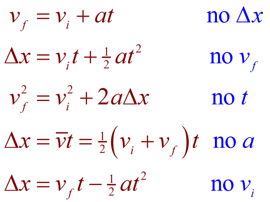

# Kinematic-Equation-Calculator

A way to solve kinematic equations faster.

I am in college physics and the amount of homework I am given involving kinematic equations
is quite large. So I am creating this calculator to better focus my attention on my other college courses.

This calculator involves the use of 5 kinematic equations, in which the variables used are
* Initial Velocity
* Final Velocity
* Displacement
* Acceleration
* Time

Each kinematic equation involves 4 of these variables.

You need at least 3 of these variables to solve for an unknown variable.

## Here are the 5 kinematic equations:

The program has 2 java files. One file called "**_controls.java_**", and another called "**_kinematicEquations.java_**"

"**_controls.java_**" consists of a scanner for input, printing to the terminal for output, and a control structure to decide which of the five equations to use.

"**_kinematicEquations.java_**" consists of 5 methods, each one representing a different kinematic equation. The parameters of each equation are 
the 4 variables (double) used in the equation and a missing variable to represent which of the 4 variables were unknown. 
(the target, unknown, variable in the equation will be set to zero and its "index" will be logged in the missing variable, to later be changed by the method)

For example, the method _notDisplacement_ would be used if the knowns and target unknown make up finalVelocity, initialVelocity, acceleration, and time.

`public static double notDisplacement(double finalVelocity, double initialVelocity, double acceleration,  double time, int missing)`

Let's say that _finalVelocity_ was the target unknown, and the knowns were _initialVelocity_, _acceleration_, and _time_.

--> _finalVelocity_ would be set to 0.0, and _missing_ would be set to 0.

The _missing_ value represents the position in the arguments where the target unknown value is.

Each method a conditional statement that takes the value of _missing_ and assigns the proper version of the kinematic equation in order to find the target unknown.

